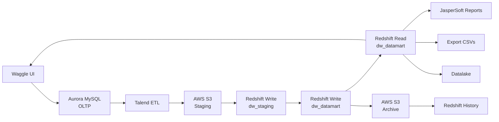
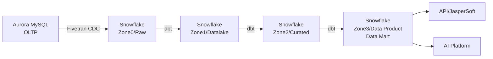

# HMH Waggle — Baked-In Context

## Company Overview

**Houghton Mifflin Harcourt (HMH)** is a major education publisher. They acquired NWEA and are undergoing a "Greenfield" unification — merging NWEA and HMH into a single organization, integrating systems and tools. This is the strategic window to redesign data architecture before the merge completes.

- **Snowflake footprint**: 4 accounts in AWS us-west-2 under org WSWZONP (NWEAMAP, NWEA_PRD, NWEA_EDW, NEA42773)
- **Renewal**: Base ACV ~$650k
- **Products**: 10-12 products in ecosystem (many from acquisitions)
- **CoCo adoption**: 184 all-time users, 1,358 billable credits consumed. Top users include Mahesh Birajdar.

## Key Stakeholders

| Name | Role | Relevance |
|------|------|-----------|
| **Nagaraj** | Director of AI Engineering | Executive sponsor. New to HMH (<6 months). Driving AI platform initiative. Using Waggle as playground. Wants centralized data for AI. |
| **Mahesh Birajdar** | Sr Data Architect | Technical lead. Built architecture docs 2.5 years ago. Deep system knowledge. Active CoCo user. |
| **Jonathan Dawson** | (Previous contact) | Originally championed this migration ~2.5 years ago. Priorities shifted. |
| **Product Manager** | (TBD — couldn't join initial call) | Represents product requirements for Waggle. Russ wants to connect. |

### Snowflake Team
- **Roy Ballard** — Account Executive (education domain expertise, worked with PowerSchool, McGraw Hill)
- **Russ Goldin** — Senior Solution Engineer
- **Carys Williams** — SDR (reconnected the relationship via LinkedIn)

## Application: Waggle

**Waggle** is an education platform (Student Information System / adaptive learning) used by:
- **Teachers** — assign work, view progress, generate reports
- **Students** — complete assignments, practice skills
- **Administrators** — district/school-level reporting and analytics

The application UI feeds into Aurora MySQL (OLTP) and consumes data from the analytics layer (JasperSoft reports, API feeds back to UI).

## Current Architecture

### Data Flow (Current State)

### Technical Details

| Component | Details |
|-----------|---------|
| **Source DB** | Aurora MySQL (OLTP data store) |
| **ETL Tool** | Talend (batch processing, 3 instances in logical layer) |
| **Staging** | AWS S3 (intermediate hop) |
| **DWH** | Amazon Redshift — separate read/write clusters |
| **Write Cluster** | 215 tables, ~3,000 million (3B) records |
| **Read Cluster** | 65 tables, ~79 million records |
| **History/Archive** | Redshift History cluster (via S3) — recently discovered by Nagaraj |
| **Reporting** | JasperSoft (reports from read cluster) |
| **Exports** | CSV files (Windows Server destination) |
| **Datalake** | Receives from Redshift, feeds back to Waggle ADB/TDB |
| **User Events** | Waggle UI generates user events (separate from OLTP path) |
| **Stored Procs** | Exist in MySQL layer (transformation logic) |

### Talend's Role (Triple Duty)

Talend appears in THREE places:
1. **Extract** from Aurora MySQL → S3
2. **Load/Transform** from S3 → Redshift (staging → datamart)
3. **Export** from Redshift → downstream (JasperSoft, CSVs, Datalake)

This tight coupling is a key migration risk. Each function needs a different replacement.

## Proposed Target Architecture (from HMH)

**Stack choice (from Mahesh):**
- **DWH**: Snowflake
- **Ingestion**: Fivetran (CDC — only delta rows fetched at regular intervals)
- **Transformation**: dbt
- **Orchestration**: Airflow (or dbt/Fivetran native scheduling)

**Notes from call:**
- Zone layers "can change — we might not really require these many layers"
- Fivetran/dbt recently merged — new combined capabilities available
- Airflow mentioned but not committed

## Strategic Drivers

1. **Enterprise consolidation**: Snowflake already chosen as enterprise data store. 10-12 products need centralization. Each product having its own data store makes AI difficult.
2. **AI platform**: Nagaraj's primary mandate. Wants to build common AI capabilities across products. Needs centralized data foundation.
3. **Cost reduction**: AWS/Redshift/Talend licensing costs are a factor (not the primary driver).
4. **SnowConvert awareness**: Heard about automated conversion, which motivated renewed outreach (lowers estimates significantly).
5. **Speed**: Nagaraj explicitly wants this "as quickly as possible" — has executive backing.

## AI Platform Requirements (from Nagaraj)

Nagaraj wants to build an **AI platform with common capabilities** across HMH products:

| Capability | Status | Notes |
|-----------|--------|-------|
| **GenAI** | Definite | Customer-facing AI capabilities for products |
| **Agentic** | Definite | Multi-step reasoning, tool use |
| **Predictive Analytics** | Discovery phase | Recommendation engines, forecasting |
| **Semantic Layer** | In talks | Wants Cortex-based semantic layer on Snowflake |
| **In-App AI** | Implied | Student/teacher facing experiences (like PowerSchool's Power Buddy) |

**Key quote from Nagaraj**: "For everything, from a data standpoint, definitely the Snowflake is our go-to choice."

## Competitive Context

- **PowerSchool** — Large Snowflake customer, built "Power Buddy" (AI assistant for students, teachers, administrators, parents). Roy showed this to HMH team.
- **McGraw Hill** — Was "way far behind" HMH 2.5 years ago on data/AI
- HMH is in a good position to leapfrog competitors given Snowflake's current AI capabilities (which didn't exist when PowerSchool started)

## HMH Broader Data Architecture (beyond Waggle)

From prior knowledge:
- **Kafka → Spark → Airflow → Postgres (50TB RDS approaching limits)** for SAPE assessment events
- Latency requirements vary: teachers need results immediately, admins within 12 hours, quarterly for campus-wide
- ~24K Snowflake credits/day across 3 accounts currently
- WAF log ingestion being migrated to Snowpipe Streaming v2

## Timeline & Status

- **Initiative age**: 2.5 years (originated with Jonathan Dawson, shelved due to priority changes)
- **Current status**: "Initiation phase" — no timelines defined yet
- **Catalyst**: Nagaraj joined, got executive backing, wants to move fast
- **Blocking factor**: Need Snowflake's questions answered → then engineering walkthrough → then timelines
- **Next step**: HMH wants structured questions from Snowflake, will bring core engineering team for followup call
