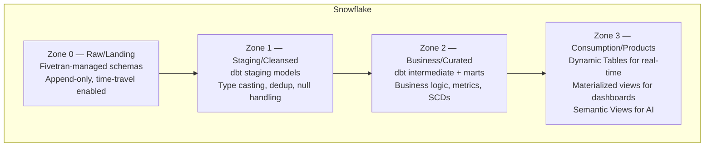
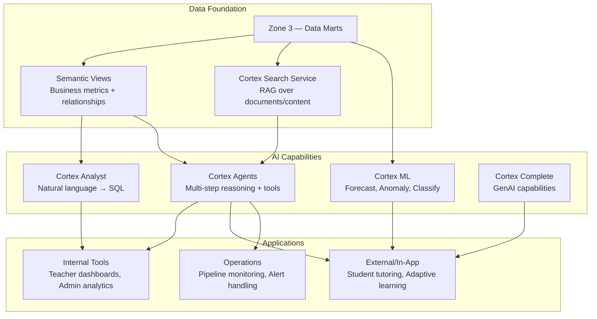

# Phase 3: Architecture Recommendations — Detailed Instructions

## Overview

Phase 3 synthesizes findings from Phases 1 and 2 to produce a target architecture recommendation covering the data platform migration AND the AI platform layer.

## Prerequisites

1. **Phase 1** (`01-current-state-discovery.md`) — answers to discovery questions
2. **Phase 2** (`02-aim-assessment.md`) — AIM assessment results, conversion feasibility

## Step 3.1 — Review Prior Phase Outputs

Read both prior phase output files. Summarize:
- Total object count and conversion feasibility
- Key risks and blockers identified
- SLA and latency requirements
- Team capacity and skill gaps
- AI platform requirements and priorities

## Step 3.2 — Lift/Shift vs. Refactor Decision

Present the decision framework:

> **Option A: Lift & Shift (Replatform)**
> - Convert Redshift DDLs to Snowflake using SnowConvert AI (automated)
> - Replace Talend with Fivetran (same patterns, different tool)
> - Minimal logic changes — replicate existing architecture on Snowflake
> - **Pros**: Fastest, lowest risk, proven with AIM tooling
> - **Cons**: Carries forward technical debt, doesn't optimize for Snowflake strengths
> - **Best when**: Timeline is critical, team is small, need quick win to build momentum
>
> **Option B: Refactor (Modernize)**
> - Redesign data model for Snowflake (eliminate sort/dist keys, leverage clustering, semi-structured)
> - Redesign transformations in dbt (modular, tested, documented)
> - Leverage Dynamic Tables for real-time marts
> - Implement proper medallion/zone architecture
> - **Pros**: Better performance, lower cost long-term, enables AI platform properly
> - **Cons**: More effort, longer timeline, requires dbt expertise
> - **Best when**: AI platform is the primary driver, team has bandwidth, want long-term value
>
> **Option C: Hybrid (Recommended for HMH)**
> - **Phase A**: Lift & shift the data (DDL conversion + Fivetran for ingestion) — gets data into Snowflake fast
> - **Phase B**: Refactor transformations into dbt incrementally (wave by wave)
> - **Phase C**: Build AI platform layer on top of migrated/refactored data
> - **Pros**: Quick time-to-value, builds momentum, allows learning, enables AI work in parallel
> - **Cons**: Temporary duplication of some logic during transition
>
> Which approach aligns with your priorities?

⚠️ **STOP**: Get user input on preferred approach before designing target architecture.

## Step 3.3 — Target Data Architecture

Based on selected approach, design the target architecture.

### Ingestion Layer

| Source | Tool | Pattern | Frequency |
|--------|------|---------|-----------|
| Aurora MySQL (OLTP) | **See evaluation below** | CDC (binlog) | Near-real-time (5-15 min) |
| User Events (if streaming needed) | Snowpipe Streaming v2 | Direct API ingest | Real-time (<10s) |
| File uploads (if any) | Snowpipe | Auto-ingest from S3 | Event-driven |
| External data (3rd party) | Fivetran or Openflow | Scheduled | Daily/hourly |

### Ingestion Tool Decision: Fivetran vs. Snowflake-Native

**Present this decision framework to the user.** The right choice depends on their answers from Phase 1 Section 3.2.

| Criteria | Fivetran | Openflow (Snowflake-native) | Snowpipe Streaming |
|----------|----------|----------------------------|-------------------|
| **MySQL CDC** | Yes (mature, production-proven) | Yes (GA connector) | Via Kafka Connect or SDK |
| **Latency** | 5-15 min (configurable) | Minutes (pipeline-dependent) | <10 seconds |
| **Other connectors** | 500+ SaaS/DB connectors | Growing library (fewer today) | N/A (programmatic) |
| **Cost model** | Per-row pricing (can be expensive at scale) | Snowflake credits only | Snowflake credits only |
| **Management** | Fully managed SaaS | Native Snowflake UI (visual pipelines) | Self-managed (SDK code) |
| **Vendor count** | +1 vendor (Fivetran) | Zero additional vendors | Zero additional vendors |
| **Schema evolution** | Automatic handling | Automatic handling | Manual |
| **Monitoring** | Fivetran dashboard + alerts | Snowflake native monitoring | Custom |

**Decision logic:**

```
IF only MySQL needs CDC AND latency > 5 min acceptable:
  → Recommend OPENFLOW (fewest vendors, native, cost-efficient)
  
IF multiple SaaS sources (Salesforce, HubSpot, etc.) also need ingestion:
  → Recommend FIVETRAN (broadest connector library)
  
IF latency < 10 seconds required for any source:
  → Recommend SNOWPIPE STREAMING (for that source)
  → Can combine with Openflow/Fivetran for other sources
  
IF HMH already has Fivetran contract across other products:
  → Recommend FIVETRAN (leverage existing relationship, consistent tooling)
  
IF cost optimization is critical AND sources are limited:
  → Recommend OPENFLOW (no per-row pricing, just credits)
```

**Note**: These are NOT mutually exclusive. A hybrid approach (Openflow for MySQL, Snowpipe Streaming for real-time events) is valid.

**Key design decisions:**
- Talend's extraction role is replaced (by whichever tool is selected above)
- CDC gives near-real-time freshness without full table scans
- S3 intermediate hop is eliminated (direct load to Snowflake)
- For sub-second requirements (in-app AI): consider Snowflake Postgres or caching layer

### Storage Layer (Zone Architecture)



**Design notes:**
- Zone 0 is Fivetran-managed (don't modify)
- Zone 1-2 are dbt-managed (version controlled, tested)
- Zone 3 includes Dynamic Tables (auto-refreshing marts), Semantic Views (for Cortex Analyst), and API-serving tables
- May consolidate to 3 zones (raw/curated/consumption) if 4 is overkill for Waggle's scale

### Transformation Layer

| Tool | Purpose | When to Use |
|------|---------|-------------|
| **dbt Core/Cloud** | SQL transformations, testing, documentation | All staging → mart logic |
| **Dynamic Tables** | Auto-refreshing materialized views | Real-time marts, dashboards |
| **Snowflake Tasks + Stored Procs** | Complex procedural logic, orchestration | Outbound feeds, complex ETL |
| **Snowpark (Python/Java)** | Custom logic that's hard in SQL | ML feature engineering, API calls |

### Orchestration Layer

| Option | Pros | Cons | Recommendation |
|--------|------|------|----------------|
| **dbt Cloud** | Native scheduling, CI/CD, observability | Cost, less flexible for non-dbt tasks | Good if dbt-centric |
| **Airflow (MWAA)** | Flexible, handles mixed workloads | Operational overhead, AWS dependency | Good if already have Airflow |
| **Snowflake Tasks** | Zero infrastructure, native | Less visible DAG, limited UI | Good for simple chains |
| **Fivetran + dbt** | Unified, triggered transforms after sync | Limited to Fivetran → dbt pattern | Simplest if using Fivetran |
| **Openflow + dbt** | Native ingestion triggers dbt | Fewer external deps | Simplest if using Openflow |

**Recommendation for HMH**: Start with ingestion-triggered dbt (whether Fivetran or Openflow triggers). Add Airflow later only if orchestration complexity demands it.

### Compute Layer

| Warehouse | Purpose | Size | Scaling |
|-----------|---------|------|---------|
| `WAGGLE_INGEST_WH` | Fivetran loading | XS | Auto-suspend 60s |
| `WAGGLE_TRANSFORM_WH` | dbt runs, Tasks | S-M | Auto-suspend 120s |
| `WAGGLE_REPORTING_WH` | JasperSoft, dashboards | S | Multi-cluster (min 1, max 3) |
| `WAGGLE_AI_WH` | Cortex functions, ML | M | Auto-suspend 300s |
| `WAGGLE_API_WH` | App-layer queries | XS-S | Multi-cluster, always-on if needed |

### Security Layer

- **FERPA/COPPA compliance**: Row-level security policies (district isolation), column masking (PII)
- **Role hierarchy**: WAGGLE_ADMIN → WAGGLE_ANALYST → WAGGLE_READONLY (+ service roles for Fivetran, dbt, JasperSoft)
- **Network**: Private connectivity (AWS PrivateLink if required)
- **Encryption**: Customer-managed keys (Tri-Secret Secure) if compliance demands

## Step 3.4 — AI Platform Architecture

Read `references/ai-capabilities-matrix.md` for the full mapping.

### AI Platform Design



### AI Capability Mapping for Waggle

| HMH Need | Snowflake Feature | Implementation |
|----------|-------------------|----------------|
| "How are my students performing?" | Cortex Analyst + Semantic Views | Define metrics (proficiency, at-risk, growth) in semantic views. Teachers ask in natural language. |
| Intelligent tutoring | Cortex Complete + Cortex Search | RAG over curriculum content. Cortex Search indexes learning materials. Complete generates explanations. |
| Student risk prediction | Cortex ML (CLASSIFICATION) | Train on historical data (attendance, scores, engagement). Score weekly. Alert teachers. |
| Content recommendation | Cortex ML + custom Snowpark | Collaborative filtering on student interaction data. Snowpark for feature engineering. |
| Automated reporting | Cortex Agents | Agent queries data, generates narrative summary, emails to district admin. |
| Adaptive assessment | Cortex Complete + custom logic | Item selection based on IRT models + LLM for generating explanations. |
| Pipeline monitoring | Cortex Agents + Alerts | Agent monitors freshness, detects anomalies, auto-triages failures. |

### Ontology / Knowledge Graph

For the education domain, define an ontology:

```
District → School → Class → Section
Teacher → Class (teaches)
Student → Section (enrolled_in)
Student → Assignment (completes)
Assignment → Standard (assesses)
Student → Assessment (takes)
Assessment → Score (produces)
```

This ontology powers:
- Semantic views (correct joins and aggregations)
- Cortex Agent routing (which tool to use for which entity)
- Natural language disambiguation ("my students" = teacher's current classes)

## Step 3.5 — Credit Estimation & Cost Model

Read `references/credit-estimation.md` Steps 2-4 for the full methodology.

Using the usage metrics collected in Phase 1 (Step 1.4), build the Snowflake credit projection:

1. **Map workloads to warehouses** — assign each workload (ingestion, transform, reporting, app/API, AI) a warehouse size based on query complexity and data scan volume from the current environment.

2. **Estimate active hours** — use the Redshift query profile data (daily compute hours, batch window duration, reporting hours) to estimate how many hours each Snowflake warehouse would be active. Apply auto-suspend savings (Snowflake only charges when running).

3. **Calculate daily/monthly credits** — `credits = warehouse_size_credits × active_hours × cluster_count`. Sum across all warehouses.

4. **Add serverless and AI costs** — Dynamic Table refreshes, Cortex AI functions (per-token), Cortex Search (index + query), Tasks, Snowpipe. Use projected AI adoption from the user's Phase 1 answers.

5. **Build scenario table** — Conservative (no speedup assumed, max warehouse sizes), Expected (3x speedup, moderate auto-suspend), Optimistic (5x speedup, aggressive right-sizing).

6. **Compare to current spend** — Side-by-side: current Redshift + Talend + S3 annual cost vs. projected Snowflake + Fivetran/Openflow + dbt annual cost.

7. **12-month ramp** — Credits won't hit steady-state immediately. Model the ramp from Wave 0 through full migration + AI adoption.

Present to the user for validation:

> Here's the projected credit consumption for your target architecture. This is based on:
> - Your current query volume: [X] queries/day, [Y] compute hours/day
> - Batch window: [Z] hours nightly
> - Peak concurrency: [N] simultaneous queries
> - AI platform: phased adoption starting Month [M]
>
> [Present the monthly credit projection table]
> [Present the scenario comparison]
> [Present current vs. projected annual cost]
>
> Does this align with your budget expectations? Would you like to adjust any assumptions (warehouse sizes, refresh frequencies, AI adoption timeline)?

⚠️ **STOP**: Get user feedback on cost model before finalizing.

## Step 3.6 — Generate Output

Create `03-target-architecture.md` with:

```markdown
# HMH Waggle — Target Architecture

## Migration Approach
[Selected approach: Lift/Shift, Refactor, or Hybrid + justification]

## Target Architecture Overview
[Mermaid diagram of full end-to-end architecture]

## Ingestion Layer
[Fivetran design, CDC configuration, streaming options]

## Storage Layer
[Zone architecture, naming conventions, access patterns]

## Transformation Layer
[dbt project structure, Dynamic Tables, stored procs]

## Orchestration Layer
[Scheduling approach, DAG design, monitoring]

## Compute Layer
[Warehouse sizing, scaling policies, cost projections]

## Security & Governance
[Roles, policies, encryption, compliance controls]

## AI Platform
[Capability-by-capability design with Snowflake features]

## Comparison: Current vs. Target
| Dimension | Current (Redshift/Talend) | Target (Snowflake) | Benefit |
|-----------|---------------------------|-----------------------|---------|

## Cost Model & Credit Estimation
[Use the full output template from references/credit-estimation.md — include:
- Current state annual cost breakdown
- Projected Snowflake annual cost by workload (warehouse, credits/month, annual cost)
- Scenario comparison (conservative/expected/optimistic)
- Key assumptions listed
- 12-month credit ramp table]

## Risks & Mitigations
[Architecture risks and how they're addressed]
```
