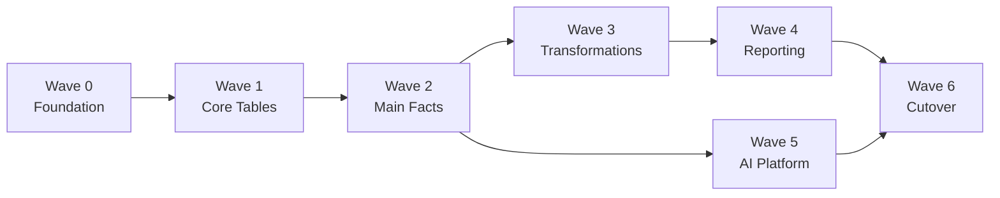

# Phase 4: Migration Execution Plan — Detailed Instructions

## Overview

Phase 4 produces the actionable migration plan — wave sequencing, validation criteria, cutover strategy, and resource requirements.

## Prerequisites

1. **Phase 1** (`01-current-state-discovery.md`) — current state inventory
2. **Phase 2** (`02-aim-assessment.md`) — conversion feasibility and risks
3. **Phase 3** (`03-target-architecture.md`) — approved target architecture

## Step 4.1 — Wave Planning

### Wave Prioritization Framework

Score each object group on:
- **Dependency depth**: How many other objects depend on this? (1-5)
- **Conversion readiness**: How clean is the AIM conversion? (1-5, 5=fully auto)
- **Business criticality**: What breaks if this is wrong? (1-5)
- **AI enablement**: Does migrating this unlock AI use cases? (1-5)

**Recommended wave structure for Waggle:**

| Wave | Scope | Rationale | Duration |
|------|-------|-----------|----------|
| **Wave 0: Foundation** | Snowflake account setup, security, networking, Fivetran connection, dbt project scaffold | No data yet — just infrastructure | 1-2 sprints |
| **Wave 1: Core Tables** | Dimension tables, reference data, small fact tables. ~20-30 tables. | Low risk, builds confidence, enables testing | 2-3 sprints |
| **Wave 2: Main Facts** | Large fact tables (student activity, assessment results, grades). Write cluster priority tables. | Core data for AI platform. Largest data volume. | 3-4 sprints |
| **Wave 3: Transformations** | Migrate staging→datamart logic from Talend to dbt. Replicate existing business logic. | Critical path — reports depend on this. | 3-5 sprints |
| **Wave 4: Reporting** | Repoint JasperSoft to Snowflake. Validate report parity. Migrate CSV exports. | User-facing — requires UAT. | 2-3 sprints |
| **Wave 5: AI Platform** | Semantic views, Cortex Analyst, first agent prototype, ML models. | Value delivery for Nagaraj's mandate. | 3-4 sprints |
| **Wave 6: Cutover** | Parallel run, validation, decommission Redshift. | Completion. | 2-3 sprints |

### Wave Dependency Graph



Note: Wave 5 (AI) can run in parallel with Wave 4 (Reporting) since AI platform uses Zone 2/3 data directly.

## Step 4.2 — Data Migration Strategy

### For Each Wave, Use AIM Data Migration:

1. **Deploy objects** to Snowflake (DDLs from SnowConvert output)
2. **Migrate data** using AIM's data-migration skill:
   - Orchestrator/Worker model
   - Partitioned parallel loading
   - ODBC from Redshift or UNLOAD to S3 → external stage → COPY INTO
3. **Validate data** using AIM's data-validation skill:
   - Row count comparison
   - Aggregate metric comparison (SUM, AVG, MIN, MAX on key columns)
   - Sample row-level comparison
   - Schema validation (data types, nullability)

### Historical Data Strategy

- **Full historical load**: One-time migration of all historical data
- **Incremental catch-up**: Daily delta loads during parallel run period
- **History/Archive**: Migrate Redshift History cluster data to Snowflake with Time Travel + long-term storage (Fail-Safe)

### Large Table Strategy (3B+ rows in write cluster)

For the largest tables:
1. Partition by date range (e.g., monthly partitions)
2. Parallel workers (AIM supports multiple workers)
3. UNLOAD to S3 → external stage → COPY INTO (fastest for large volumes)
4. Validate partition-by-partition
5. After all partitions loaded, validate aggregate totals

## Step 4.3 — Transformation Migration

### Talend → dbt Migration Steps

For each Talend job being replaced by dbt:

1. **Document current logic**: What does the job do? (inputs, transformations, outputs)
2. **Map to dbt model**: Create staging model (source → cleaned) + mart model (business logic)
3. **Write dbt tests**: Not null, unique, accepted values, relationships, row count assertions
4. **Validate parity**: Compare dbt output to existing Redshift output (row counts, checksums)
5. **Document**: Add schema.yml with descriptions, column docs

### dbt Project Structure (Recommended)

```
waggle_dbt/
├── dbt_project.yml
├── profiles.yml
├── models/
│   ├── staging/
│   │   ├── stg_waggle__students.sql
│   │   ├── stg_waggle__classes.sql
│   │   ├── stg_waggle__assignments.sql
│   │   └── _stg_waggle__sources.yml
│   ├── intermediate/
│   │   ├── int_waggle__student_activity.sql
│   │   └── int_waggle__class_performance.sql
│   └── marts/
│       ├── mart_waggle__student_proficiency.sql
│       ├── mart_waggle__district_summary.sql
│       └── _mart_waggle__schema.yml
├── tests/
│   └── assert_row_count_parity.sql
├── macros/
│   └── scd_type2.sql
└── seeds/
    └── reference_data.csv
```

## Step 4.4 — Validation Strategy

### Automated Validation (per wave)

| Check | Method | Pass Criteria |
|-------|--------|---------------|
| Row counts | COUNT(*) comparison | 100% match |
| Column sums | SUM(numeric_col) comparison | <0.01% variance |
| Null counts | COUNT(*) WHERE col IS NULL | Exact match |
| Distinct counts | COUNT(DISTINCT key_col) | Exact match |
| Sample rows | Hash comparison on random sample | 100% match on sample |
| Schema | Column names, types, nullability | Match (with allowed type upgrades) |

### Report Parity Validation (Wave 4)

For JasperSoft reports:
1. Run report against Redshift (baseline)
2. Repoint to Snowflake, run same report
3. Compare outputs (visual diff for formatted reports, data diff for underlying queries)
4. Sign-off from report owner

### Performance Validation

- Benchmark critical queries on both platforms
- Compare p50/p95/p99 query times
- Validate concurrency under load (simulate peak usage)
- Monitor warehouse utilization and scaling behavior

## Step 4.5 — Parallel Run Strategy

### Duration: 2-4 weeks recommended

During parallel run:
- Both Redshift and Snowflake are active and receiving data
- Fivetran loads to Snowflake; Talend continues loading to Redshift
- Daily automated comparison of key metrics between platforms
- Users/reports still point to Redshift (read-only)
- Issues are logged, triaged, and fixed

### Parallel Run Exit Criteria

All of the following must be true:
- [ ] Row count parity across all tables (daily check, 7 consecutive days)
- [ ] Aggregate metric parity across all marts (<0.01% variance)
- [ ] All JasperSoft reports produce identical output
- [ ] Critical query performance meets or exceeds Redshift baseline
- [ ] No P1/P2 data quality issues open
- [ ] UAT sign-off from Mahesh/Nagaraj + product team
- [ ] Rollback procedure tested and documented

## Step 4.6 — Cutover Plan

### Pre-Cutover Checklist

- [ ] All parallel run exit criteria met
- [ ] Communication sent to all stakeholders (teachers don't need to know, but admins might)
- [ ] JasperSoft connection strings updated (staged, not activated)
- [ ] API layer updated to point to Snowflake (staged, feature-flagged)
- [ ] Monitoring/alerting configured for Snowflake pipelines
- [ ] On-call team briefed on new runbooks
- [ ] Rollback plan documented and tested

### Cutover Sequence

1. **Final sync**: Ensure all in-flight Talend jobs complete. Confirm data parity one final time.
2. **Freeze**: Stop Talend writes to Redshift. Announce maintenance window if needed.
3. **Activate Fivetran**: Ensure Fivetran is primary ingestion path (should already be running in parallel).
4. **Switch reporting**: Activate JasperSoft Snowflake connections. Deactivate Redshift connections.
5. **Switch APIs**: Flip feature flag for app layer to query Snowflake.
6. **Validate**: Run smoke tests on all critical paths.
7. **Monitor**: Intensively monitor for 24-48 hours.
8. **Declare success**: After stable period, formally decommission Redshift.

### Rollback Plan

If critical issues found within 48 hours of cutover:
1. Revert JasperSoft connections to Redshift
2. Revert API feature flag to Redshift
3. Resume Talend jobs
4. Investigate and fix issue in Snowflake
5. Re-attempt cutover after fix validated

**Rollback window**: 30 days (keep Redshift running for 30 days post-cutover before decommission)

## Step 4.7 — Resource Requirements

### Team Allocation (Estimated)

| Role | Effort | Source |
|------|--------|--------|
| Data Engineer (dbt/Snowflake) | Full-time during migration | HMH team or contractor |
| Data Architect (Mahesh) | 50% — design decisions, validation oversight | HMH |
| AI Engineer (Nagaraj or delegate) | 25% Wave 1-4, 75% Wave 5 | HMH |
| Snowflake SE (Russ) | Advisory, POC support, AIM guidance | Snowflake |
| Snowflake FDE | Hands-on migration support (non-billable) | Snowflake (via Shreya) |
| Product Manager | UAT coordination, requirements for Wave 5 | HMH |

### External Support Available

- **Snowflake FDE team** (Forward Deployed Engineers): Non-billable, hands-on migration support. Contact: Shreya Agrawal.
- **Snowflake AIM tooling**: Automated DDL conversion, data migration, validation
- **Snowflake Professional Services**: Available for complex remediation or AI platform design

## Step 4.8 — Generate Output

Create `04-migration-plan.md` with:

```markdown
# HMH Waggle — Migration Execution Plan

## Executive Summary
[Approach, timeline, key milestones]

## Wave Plan
[Detailed wave breakdown with scope, dependencies, acceptance criteria]

## Data Migration Approach
[Tool chain, large table strategy, historical data handling]

## Transformation Migration
[Talend → dbt mapping, project structure, testing approach]

## Validation Strategy
[Automated checks, report parity, performance benchmarks]

## Parallel Run Plan
[Duration, monitoring, exit criteria]

## Cutover Sequence
[Step-by-step with rollback procedures]

## Resource Plan
[Team allocation, external support, skill development needs]

## Risk Register
| Risk | Likelihood | Impact | Mitigation |
|------|-----------|--------|------------|

## Open Questions / TBDs
[Items still needing answers before execution can begin]

## Immediate Next Steps
1. [First action item]
2. [Second action item]
3. ...
```
